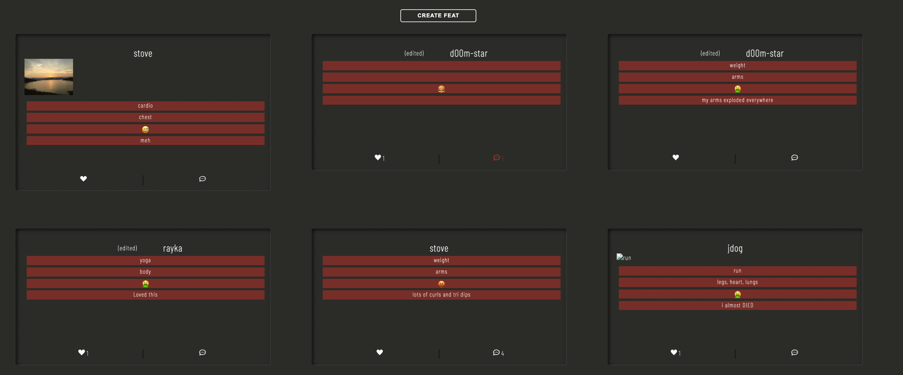
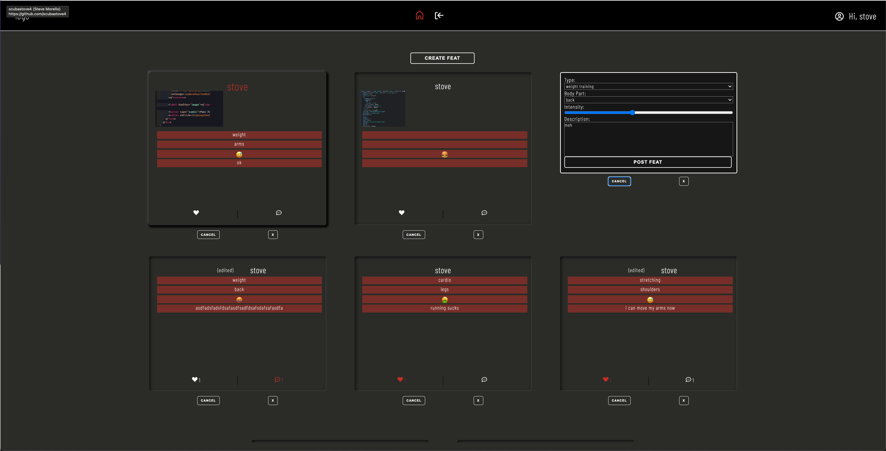
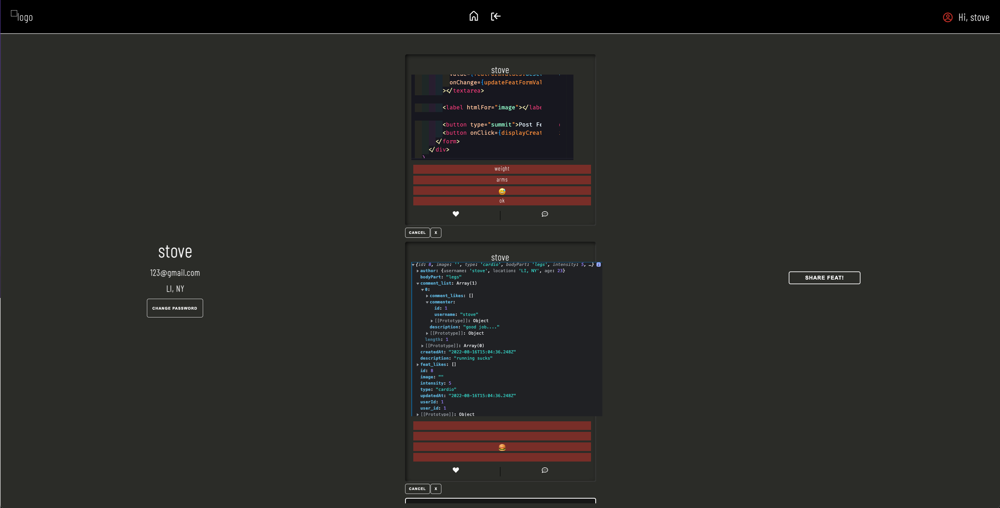

# fitter-frontend

## Date: 08/19/2022

### Collaborators

| Anaflavia Almendras                                 | John Dunn                                                 | Steve Morello                                            |
| --------------------------------------------------- | --------------------------------------------------------- | -------------------------------------------------------- |
| [GitHub](https://github.com/A-Almendras)            | [GitHub](https://github.com/d00m-star)                    | [GitHub](https://github.com/scubastove4)                 |
| [LinkedIn](https://www.linkedin.com/in/aalmendras/) | [LinkedIn](https://www.linkedin.com/in/john-michael-dunn) | [LinkedIn](https://www.linkedin.com/in/stephen-morello/) |

### **_Project Links_**

## [Trello](https://trello.com/invite/b/Tii64Mux/b676ef2972e7b8260c972527c064d530/project-3-fitter-app) | [Fitter App](https://get-fitter.herokuapp.com/) | [Backend Repository](https://github.com/scubastove4/Fitter-Backend)

## **_Description_**

Want to show off your workout routine or simply need some inspiration? Fitter is the perfect fit 😉 for you. With Fitter you are able to post your own fitness journey, as well as see what the rest of the FitFam is up to. Users will also have the ability to like and comment on other Feats.

---

## **_Technologies_**

- PostgreSQL/Sequelize
- Express
- React
- Node
- Git/Github
- CSS
- Heroku

---

## **_App Overview_**

Fitter is a full-stack PERN application that allows users to create an account to share posts regarding their fitness journey as well as like/unlike and comment other users posts. The user is able to return to their account at anytime to delete and modify their own post.

When prompted to the home page, users need to either login or sign up for an account to access the feed page. Once logged in the user is able to see posts of other users of the app as well as like/unlike and comment on their posts or create a post of their own. If the user wants to find out more info about any particular user, see all other comments regarding the post, or simply see the post in more detail they can click on any feat of their choice to be able to do that. The user is only able edit and delete their own post and not others. The user is also able to see their own account which will show all the posts they created and if need to they have the option to change their password. The user can logout and comeback to their account at anytime they chose to.

## **_Getting Started_**

Necessary packages are included in the package.json, so you just need to run npm i to install them.

## **_Screenshots_**

### Main Feed

### Editing Feats

### User Profile

## **_Task List(s)_**

- Future Updates

  - [ ] Mobile-friendly version
  - [ ] Fix image upload when editing
  - [ ] Optional image uploading
  - [ ] Delete account
  - [ ] User profile includes feats they've liked

- Completed updates

  - [x] User to be able to like and unlike feats
  - [x] User to be able to like and unlike comments
  - [x] Toggle color when user likes or comments
  - [x] Image upload and display

## **_Credits_**

- MDN:[MDN Search](https://developer.mozilla.org/en-US/)
- All of our instructors and peers
- Google Fonts : [Barlow Condense](https://fonts.google.com/specimen/Barlow+Condensed?query=barlow)
